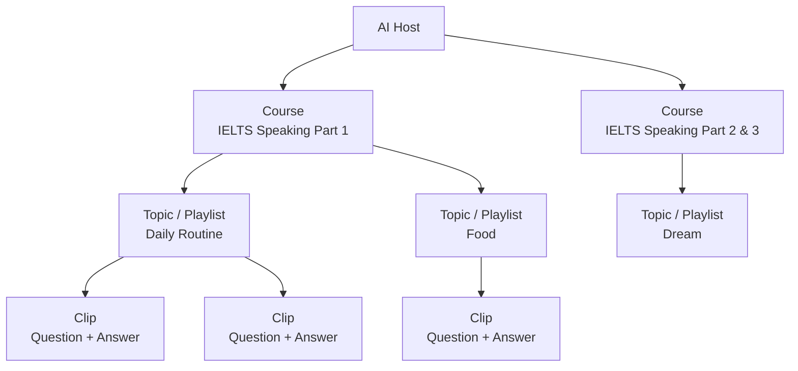

# ClipWords Backend — Django AI Conversation Engine

This repository contains the **Django backend** for the ClipWords platform.

The backend powers a system where users can **talk with AI Hosts about learning content** such as videos, clips, and phrases.

Instead of only consuming content, users can **interact with it conversationally**.

```
Watch content → Ask questions → Discuss ideas → Practice speaking
```

The backend manages **AI Hosts**, **conversation logic**, **content knowledge**, and integrates with **speech systems** for voice interaction.

## Core Idea

The platform connects **learning content** with **AI conversations**.

Each piece of content belongs to an **AI Host**, a character that understands and discusses the material with users.

Example:

```
Video → owned by Host → user talks with the Host about the video
```

This turns passive learning into **interactive dialogue**.

## Core Concepts

### Host

A Host is an AI character that represents a creator or teacher.

Hosts have:

- a defined personality
- a speaking style
- a role (teacher, examiner, tutor, etc.)
- knowledge about specific content

Hosts are implemented through a **structured prompt system** that defines their behavior and identity.

### Product (Content)

A **Product** represents learning content owned by a Host.

Products can include:

- Video
- Clip (subtitle segment from a video)
- Words or phrases extracted from subtitles

Example structure:

```
Host
  └── Courses
        └── Topics / Playlists
              └── Products (clips, videos, words)
```

Courses organize learning content created by a Host. Each course contains topics or playlists, which group related learning items.

Content Organization:



When users view this content, they can start a conversation with the Host who owns it.

### Conversation

Users can interact with Hosts in multiple ways:

- Text chat
- Voice messages
- Real-time voice calls

Each conversation is stored as a chat session, allowing the Host to maintain context within the discussion.

## AI Prompt System

The AI response is built from several prompt layers.

```
Base Prompt
+ Host Persona
+ Product Content
+ Chat Summary
+ Conversation Context
--------------------------------
LLM Response
```

Prompt components include:

- **Base Prompt** – defines general role behavior
- **Persona Prompt** – personality of the Host
- **Product Prompt** – knowledge extracted from content
- **Chat Summary** – condensed history of the session
- **Conversation Context** – recent messages of the session

This structure allows the AI to stay **in character** while discussing specific content.

## Conversation Memory

Each chat session stores message history.

To manage context size:

- when messages exceed a threshold (~50 messages)
- the system generates a conversation summary

The LLM then receives:

```
Chat Summary
+ Latest Messages
```

This keeps conversations coherent while controlling prompt length.

## Message Processing Flow

User messages follow this pipeline:

```
User Input
  ↓
Speech-to-Text (if voice)
  ↓
Prompt Builder
  ↓
LLM Response
  ↓
Response Enhancement (optional)
  ↓
Output
  ├── Text
  └── Text-to-Speech
```

Enhancement prompts can optionally modify responses to improve tone and emotional expression for voice output.

## System Architecture

The Django backend acts as **the conversation brain** of the platform.

```
React Client
      ↓
   Django API
      ↓
   AI Prompt System
      ↓
   LLM Engine
      ↓
Response returned to client
```

For voice interaction:

```
Browser
  ↓
Node Voice Gateway
  ↓
Speech APIs (STT / TTS)
  ↓
Django conversation engine
```

The Node service handles **audio streaming**, while Django coordinates the AI conversation.

## Main Applications

The backend is organized into several Django apps.

### ai/

AI integration layer.

Responsibilities:

- LLM engine integration
- speech engines (STT / TTS)
- prompt system
- AI model provider abstraction

### interact/

Conversation and interaction logic.

Responsibilities:

- chat sessions
- message history
- conversation use cases
- real-time call coordination
- usage tracking and billing

### store/

Content and knowledge system.

Responsibilities:

- Hosts
- Products (videos, clips, words)
- content context extraction
- content discovery and feeds

### core/

Platform fundamentals.

Responsibilities:

- user authentication
- shared models
- API foundations

### billing/

Usage tracking and credit management.

Responsibilities:

- credit consumption
- vouchers
- usage ledger

## Technology Stack

Backend:

- Django
- Django REST Framework
- Django Channels (WebSockets)

AI:

- DeepSeek LLM
- ElevenLabs Speech APIs

Infrastructure:

- Celery (background tasks)
- Redis (cachine, task broker)

## Development Setup

### Requirements:

- Python 3.10+
- Pipenv
- Redis

### Install dependencies:

```
pipenv install
```

Due to a dependency resolver issue with Pipenv + Python 3.12, the openai package is installed manually inside the virtual environment.

Activate the environment::

```
pipenv shell
```

Then install the package:

```
pip install openai==1.109.1
```

### Run migrations:

```
pipenv run python manage.py migrate
```

### Start development server:

```
pipenv run python manage.py runserver
```

## Project Goal

The goal of this system is to transform online learning from a **passive experience** into an **interactive conversation**.

Instead of only watching videos, users can **talk with AI Hosts that understand the content**.

## More info

- Website
  https://app.clipwords.me
- Frontend (React Client)
  https://github.com/lqfeng2022/clip-hub
- Voice Gateway (Node.js)
  https://github.com/lqfeng2022/node-service
- Backend (this repository)
